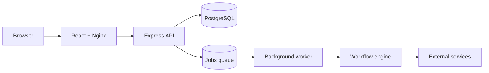

# iii3xnz

<p align="center">
	
</p>

**Self-hostable workflow automation with a visual builder, integrations, scheduling, and background execution.**

iii3xnz helps developers and teams connect services, transform data, and run repeatable workflows on infrastructure they operate. Build workflows visually, trigger them manually or automatically, inspect each step, and keep execution data in PostgreSQL.

## What you can build

- **Visual workflows** with triggers, actions, conditions, branches, filters, variables, delays, loops, and merge behavior
- **Automated execution** from manual runs, webhooks, or cron schedules
- **Programmable steps** through sandboxed JavaScript and parameterized PostgreSQL queries
- **Reusable automation** with sub-workflows, error workflows, execution history, and per-node traces
- **Team workflows** with workspaces, projects, invitations, roles, and workflow permissions
- **Self-hosted operations** with a PostgreSQL-backed queue, separate worker, retries, and stale-job recovery
- **Protected credentials** stored with AES-256-GCM encryption

The current frontend registry contains 38 workflow node types. External service nodes require credentials or provider configuration supplied by the operator.

## Integrations

**Communication:** Slack, Discord, SMTP email, Telegram, Twilio SMS, Twilio WhatsApp, Microsoft Teams

**Google:** Gmail, Google Sheets, Google Drive, Google Calendar

**Productivity and business:** Airtable, Notion, Trello, HubSpot, Mailchimp, ClickUp, Asana, Jira, Shopify, Stripe

**Developer and AI:** GitHub, GitLab, Linear, OpenAI, HTTP/API requests, PostgreSQL

Provider APIs, credentials, quotas, pricing, and availability remain controlled by their respective providers.

## Get started

### Windows

1. Official Windows releases will be published through GitHub Releases at https://github.com/iii3xnz111/iii3xnz-opensource/releases.
2. Download the current `iii3xnz-Setup.exe` from that release page.
3. Run the installer.
4. If Docker Desktop is missing, the installer uses Docker's official Docker Desktop installation flow.
5. Approve normal UAC, Docker terms, or a required Windows restart when prompted.
6. The installer starts Docker Desktop, launches PostgreSQL, the API, the worker, and the frontend, then waits for readiness.
7. Your default browser opens to the local application.
8. Create your first account.

Docker Desktop is a separate third-party product and is not bundled into this installer. WSL, virtualization, corporate policies, antivirus, proxies, and Windows permissions can affect setup.

### After installation

Use iii3xnz again from:

**Windows Start Menu -> iii3xnz**

You normally do not rerun Setup.exe, open Command Prompt, or manually run Docker commands. The launcher checks local services, starts what is needed, waits for readiness, and opens the browser. A separate `Stop iii3xnz` shortcut is also provided.

### Source and Docker Compose

For developers and advanced operators with Docker Desktop, from the repository root:

```powershell
docker compose up -d
```

Open `http://localhost` when the default frontend port is available. The stack starts PostgreSQL, the backend, the worker, and the frontend; the backend bootstraps the schema on first use.

See [docs/SELF_HOSTING.md](docs/SELF_HOSTING.md) for OAuth, email, security, and deployment configuration.

## Code signing policy

Official Windows releases are intended to use SignPath Foundation Open Source Code Signing, subject to SignPath Foundation acceptance and configuration. For the public repository and release documentation, see [CODE_SIGNING.md](CODE_SIGNING.md) and [PRIVACY.md](PRIVACY.md).

"Free code signing provided by SignPath.io, certificate by SignPath Foundation"

This repository is prepared for the intended public release flow and the GitHub Releases distribution model, but no release has been signed yet and no SignPath certificate is claimed to exist before external approval.

## Architecture



## Self-hosted data

Self-hosted mode disables local billing and enables the registered workflow nodes through the self-hosted plan logic. PostgreSQL stores accounts, workspaces, workflows, credentials, jobs, executions, and audit records. Generated JWT and encryption secrets are stored in a persistent Docker volume.

Normal stop/start and the verified reinstall flow preserve application volumes. Normal uninstall removes application files but does not remove the tested PostgreSQL or secret volumes. Persistent storage is not a backup policy: operators remain responsible for backups and restores.

## Authentication and security

The implementation includes email/password authentication, bcrypt password hashing, JWT sessions, Remember Me sessions, optional Google identity verification, OTP verification, password reset, workspace authorization, encrypted credentials, rate limiting, parameterized queries, SSRF protections, sandboxed code execution, and Dodo webhook signature verification.

These are implementation controls, not a security certification or a guarantee that every deployment is secure. Public deployments need operator-managed HTTPS, database protection, secrets, backups, and provider configuration.

## Configuration

The root [.env.example](.env.example) lists configuration names without values. Important categories include:

- Backend and database: `DATABASE_URL`, `PORT`, `APP_URL`
- Security: `JWT_SECRET`, `ENCRYPTION_KEY`
- Internal queue: `INTERNAL_CRON_SECRET`
- Email: `APP_SMTP_*`, `BREVO_API_KEY`
- OAuth: `GOOGLE_*`, `SLACK_*`, `GITHUB_*`, `MICROSOFT_*`, `HUBSPOT_*`
- Cloud billing: `DODO_*`
- Frontend: `VITE_API_URL`, `VITE_SELF_HOSTED`, `VITE_SUPPORT_EMAIL`

Never commit real secret values. Review [docs/SELF_HOSTING.md](docs/SELF_HOSTING.md) before exposing a deployment publicly.

## Development

Requirements: Node.js `>=22.0.0 <24.0.0`, npm, Docker Desktop/Compose for the full stack, and Inno Setup 6 for Windows installer builds.

```powershell
cd backend
npm install
npm start
```

Run the worker in another terminal:

```powershell
cd backend
npm run worker
```

Run the frontend development server:

```powershell
cd frontend
npm install
npm run dev
```

Build the frontend:

```powershell
cd frontend
npm run build
```

Build the Windows installer:

```powershell
powershell -NoProfile -ExecutionPolicy Bypass -File .\installer\build-installer.ps1
```

## Testing

```powershell
cd backend
npm test
```

The suite covers API behavior, authentication, crypto, plans, workflows, queues, RBAC, OAuth, mailer behavior, webhooks, node registration, and SSRF protections. Some API tests require disposable PostgreSQL and ephemeral security environment variables. Optional live integration tests require sandbox credentials.

The focused audit checks passed for the frontend build, Remember Me storage, authentication sessions, credential encryption, plan logic, node registration, and SSRF protections. A previous full backend run reported 93 of 94 tests passing; the remaining failure was an OTP development-mailer log assertion.

## Contributing

See [CONTRIBUTING.md](CONTRIBUTING.md) for the contribution workflow. Focused pull requests, regression tests, security-aware changes, and documentation improvements are welcome.

There is currently no dedicated `SECURITY.md` document. For sensitive reports, coordinate with the project owner before public disclosure and do not publish credentials or exploit details.

## Third-party services and license

External services have their own terms, privacy policies, pricing, quotas, licenses, and availability. Product and service names belong to their respective owners. Runtime dependency licenses and attribution are collected in [THIRD-PARTY-NOTICES.txt](THIRD-PARTY-NOTICES.txt).

This repository uses the Apache License 2.0. See [LICENSE](LICENSE). Copyright ownership and public-release licensing should receive human/legal review before broad distribution.
